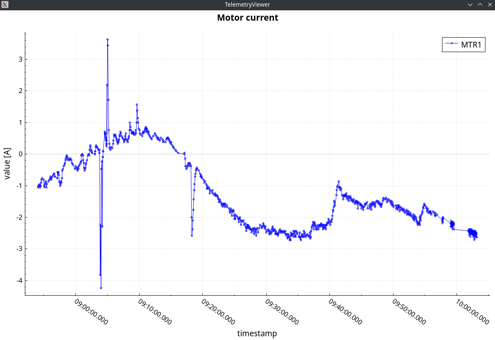

# TelemetryViewer

TelemetryViewer — это GUI-приложение для визуализации телеметрии некоторого параметра.
Оно отображает график изменения параметра по данным из текстового файла заданного формата (см. ниже)

## Демо

Ниже представлен демонстрационный график, построенный в TelemetryViewer




## Зависимости

- Qt 6 (Widgets, PrintSupport)
- QCustomPlot 2.1.1

## Сборка

```bash
git clone <repo-url> TelemetryViewer
cd TelemetryViewer

cmake -S . -B build -DCMAKE_BUILD_TYPE=Release
cmake --build build --parallel
```

## Запуск

Приложение запускается из консоли и принимает один обязательный аргумент: путь до файла телеметрии

```bash
./build/TelemetryViewer /path/to/TelemetryData.txt
```

Для вывода справки по использованию следует передать `-h` или `--help`

```bash
./build/TelemetryViewer --help
```

## Формат файла телеметрии

Первая непустая строка в файле телеметрии содержит метаданные
в формате ```index unit name```, где:

- `index` — индекс параметра
- `unit` — единицы измерения параметра (указываются в квадратных скобках `[]`)
- `name` — имя параметра (может содержать пробелы)

Далее идут строки измерений параметра
в формате ```date time timestamp valueCode value```, где:

- `date` — дата в формате `yyyy.MM.dd`
- `time` — время в формате `HH:mm:ss.zzz`
- `timestamp` — время в миллисекундах
- `valueCode` — целочисленный код значения параметра
- `value` — значение параметра

Пустые строки игнорируются.
Пробельные символы в начале и конце каждой строки игнорируются.
Все значения (токены) разделены символом табуляции

Пример содержимого файла телеметрии представлен ниже

```
MTR1 [A] Motor current

2025.07.12	14:07:34.057	1752318454057	5	3.10
2025.07.12	14:07:35.020	1752318455020	5	3.11
2025.07.12	14:07:35.097	1752318455097	5	3.05
...
```
